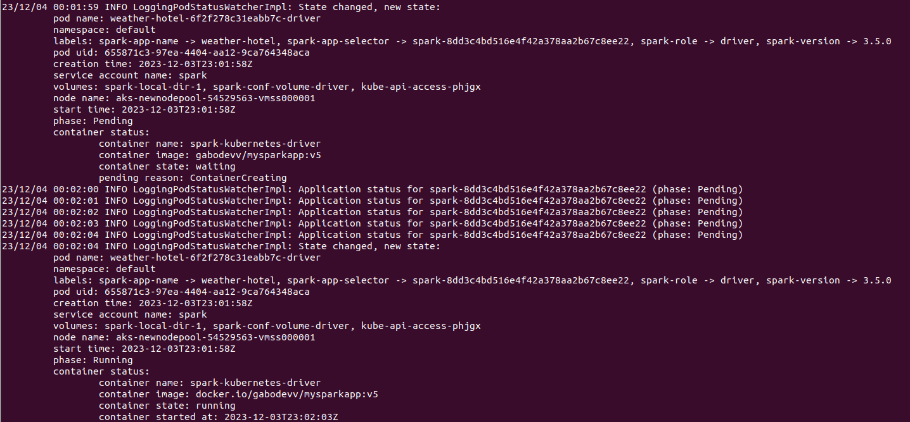
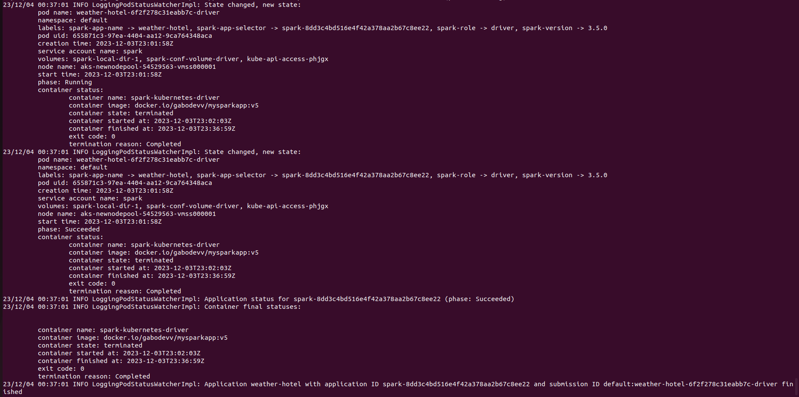
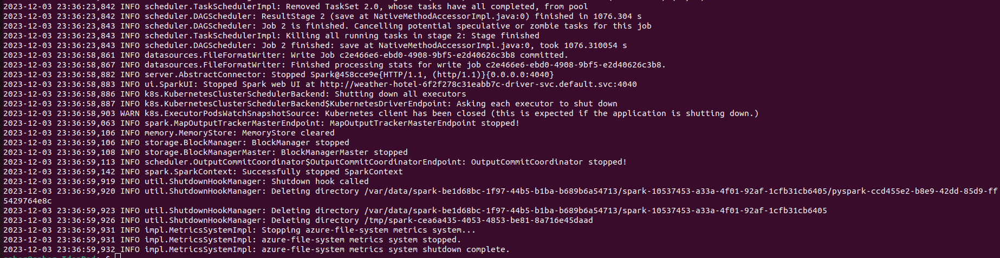
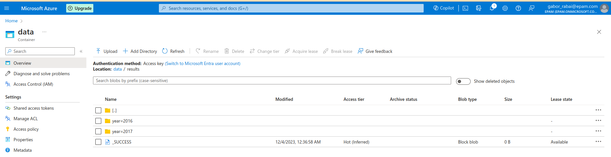

* Deployed infrastructure with terraform (added credentials, in the resource "azurerm_kubernetes_cluster" "bdcc" block, changed default node pool's vm size from "Standard_D2_v2" to "Standard_D3_v2")
* Launched AKS
* Created a service account that has sufficient permissions for running a job
* Ran proxy
* Built and pushed docker image to my docker.Hub repo
* Launched Spark app in cluster mode on AKS
```
spark-submit \
    --master k8s://http://127.0.0.1:8001 \
    --deploy-mode cluster \
    --name weather-hotel \
    --conf spark.kubernetes.authenticate.driver.serviceAccountName=spark \
    --conf spark.kubernetes.container.image=gabodevv/mysparkapp:v5 \
    local:///opt/spark_task.py
```
* First driver pod will create a Container and starts running 
* 
* After that it will create two executor pods and start the jobs
* Upon completion a message states that the container state is terminated and the reason is: Completed
* 
* kubectl logs weather-hotel-6f2f278c31eabb7c-driver command shows log for the driver pod
* Message after finishing the last stage of the job:

* Checked if parquet files are in the data lake

